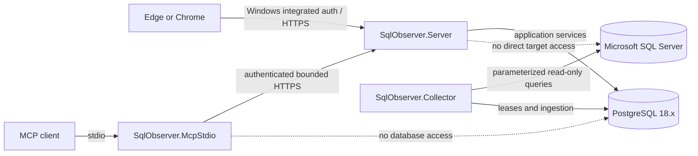

# SqlObserver

SqlObserver is a clean-room, Windows-hosted monitoring and diagnostics product for Microsoft SQL Server. It is intended to collect bounded, historical evidence without installing an agent on monitored database hosts by default. PostgreSQL 18.x is the product's application repository; it is not a monitored database engine.

> **Repository status:** Milestone 0 and the non-runtime scaffolding portion of Milestone 1. This repository does not yet contain a production collector, deployable monitoring service, database schema, installer, or supported release.

## Product boundary

SqlObserver is designed to provide historical telemetry, query diagnostics, wait and blocking analysis, deadlock evidence, alerts, baselines, reports, forecasts, and incident correlation. Its eventual MCP surface is an allowlisted, read-only diagnostic interface.

The boundary is deliberately narrow:

- monitored engines are Microsoft SQL Server; PostgreSQL stores SqlObserver configuration and observations;
- default monitoring is remote and agentless;
- passive monitoring does not alter a monitored SQL Server instance;
- any enhanced monitoring configuration is delivered separately as a reviewable, DBA-run script and is never applied automatically;
- neither the web API nor MCP is a general-purpose SQL console;
- query text, plans, object names, comments, errors, XML, and job steps are sensitive, untrusted data;
- all persisted timestamps use UTC.

The implementation is original. See [the clean-room boundary](docs/product/clean-room-boundary.md) and [ADR-0009](docs/adr/ADR-0009-clean-room-boundary.md).

## Architecture

SqlObserver is a modular monolith with three separately deployable .NET processes and a React/TypeScript client:

| Process | Responsibility |
| --- | --- |
| `SqlObserver.Server` | ASP.NET Core API, web assets, SignalR, Windows authentication, RBAC, reports, and the MCP HTTP endpoint |
| `SqlObserver.Collector` | Windows Worker Service for scheduling, bounded collection, ingestion, alert evaluation, rollups, baselines, partition care, and retention |
| `SqlObserver.McpStdio` | Local MCP stdio bridge that authenticates to `SqlObserver.Server`; it has no database or target connection |
| PostgreSQL 18.x | Configuration, security metadata, telemetry, analytics, alert state, reporting data, and audit records |

Code is separated into domain, application, infrastructure, collector, analysis, security, audit, and host projects while remaining one product and one release train. PostgreSQL-backed leases coordinate workers before any separate broker is considered.



More detail is in [the architecture overview](docs/architecture/overview.md), [support matrix](docs/architecture/support-matrix.md), and [threat model](docs/architecture/threat-model.md).

## Quick start for contributors

The current quick start validates scaffolding only.

Prerequisites:

- Windows Server 2022/2025, or a Windows development workstation used only as an uncertified build host;
- .NET 10 SDK;
- a Node.js release supported by the checked-in frontend toolchain and its lockfile;
- pnpm 11.19.0, as pinned by `web/package.json` and CI;
- PowerShell 7 (`pwsh`);
- Git;
- PostgreSQL 18.x only when database integration validation is introduced.

From the repository root, run:

```powershell
pwsh ./tools/validate.ps1
```

The validation entry point is expected to restore locked dependencies, compile with warnings treated as errors, run applicable tests, build the strict TypeScript frontend, and perform repository-policy checks. During this scaffold milestone, stages without runtime artifacts may report that they are not yet applicable; they must not silently claim runtime coverage.

Do not provision production credentials or point this scaffold at a production SQL Server. Development setup scripts are not production installers.

## Repository map

| Path | Purpose |
| --- | --- |
| `src/` | .NET domain, application, infrastructure, feature libraries, and executable hosts |
| `web/` | Strict React/TypeScript client skeleton |
| `database/migrations/` | Future immutable, numbered PostgreSQL SQL migrations |
| `database/functions/`, `database/views/` | Versioned SQL-first repository objects |
| `database/seeds/`, `database/testdata/` | Non-production reference and test inputs |
| `collectors/manifests/` | Versioned collector metadata contracts |
| `collectors/sql/` | Future parameterized, supported SQL Server collection statements |
| `installer/wix/`, `installer/postgres/` | Future Windows and PostgreSQL packaging |
| `tests/` | Unit, integration, contract, security, performance, and end-to-end suites |
| `docs/architecture/` | Architecture, support policy, and threat model |
| `docs/adr/` | Architecture decision records |
| `docs/product/` | Product vocabulary and clean-room rules |
| `docs/runbooks/` | Future operator procedures; no runtime runbooks exist yet |
| `tools/` | Repository validation and future local-development helpers |
| `.github/workflows/` | Continuous integration definitions |

## Milestone scope

Milestone 0 establishes the product boundary, architecture, support posture, threat model, terminology, and decisions. The non-runtime portion of Milestone 1 adds compilable/buildable skeletons, validation plumbing, directory placeholders, and CI. [BACKLOG.md](BACKLOG.md) is the requirement-to-milestone map and records what remains.

No production collection, ingestion, alerting, analytics, MCP tool implementation, database migration, deployment, or upgrade behavior is part of this assignment.

## Non-goals for this milestone

- Monitoring a live SQL Server or collecting sample data.
- Creating PostgreSQL application tables or applying migrations.
- Shipping an MCP server or any `execute_sql`-style capability.
- Changing Query Store, Extended Events, blocked-process settings, indexes, plans, sessions, or server configuration.
- Shipping an installer or claiming support certification.
- Reproducing another product's schema, API, user interface, wording, artwork, or internal behavior.

See [CONTRIBUTING.md](CONTRIBUTING.md) before making changes and [SECURITY.md](SECURITY.md) for the rules that all later milestones must preserve.
