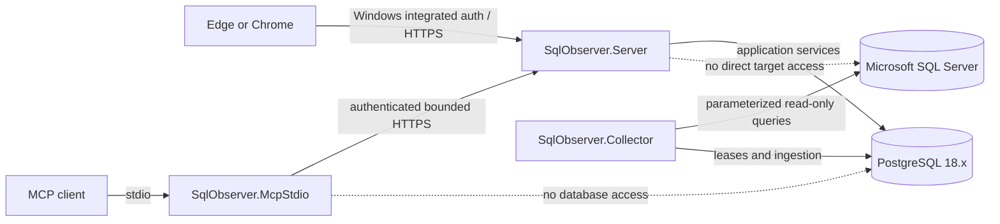

# SqlObserver

M9 operational health assets (backups, SQL Agent failures, TempDB, and Availability Groups) are implemented locally with certification pending. They use passive, checksum-pinned SQL and target-scoped bounded projections; no backup, job, TempDB, or AG mutation is performed. M12 defines a versioned certification matrix and fail-closed evidence verifier: Local validation is explicitly non-release evidence, while Release validation requires every external lab and hashed run artifact.

SqlObserver is a clean-room, Windows-hosted monitoring and diagnostics product for Microsoft SQL Server. It is intended to collect bounded, historical evidence without installing an agent on monitored database hosts by default. PostgreSQL 18.x is the product's application repository; it is not a monitored database engine.

> **Repository status:** Milestones 0 through 11 are implemented locally. M5 activity, M6 deadlock, and M7 Query Store slices are bounded and passive. M8 adds fenced alerting and audited administration; M9 adds bounded operational health; M10 adds target-scoped analytics, host/replication evidence, incidents, and disabled-by-default retention controls; M11 adds the authenticated, audited, exactly allowlisted read-only MCP HTTP/stdio surface. PostgreSQL integration execution requires Docker/PostgreSQL 18.4 and SQL Server lab execution requires the configured Windows/SSPI environment; SqlObserver is not yet a supported release, and M12 reports, installers, deployment, and release/platform certification remain incomplete.

## Product boundary

SqlObserver is designed to provide historical telemetry, query diagnostics, wait and blocking analysis, deadlock evidence, alerts, baselines, reports, forecasts, and incident correlation. Its MCP surface is an allowlisted, read-only diagnostic interface; reports remain an M12 deliverable.

The boundary is deliberately narrow:

- monitored engines are Microsoft SQL Server; PostgreSQL stores SqlObserver configuration and observations;
- default monitoring is remote and agentless;
- passive monitoring does not alter a monitored SQL Server instance;
- any enhanced monitoring configuration is delivered separately as a reviewable, DBA-run script and is never applied automatically;
- neither the web API nor MCP is a general-purpose SQL console;
- query text, plans, object names, comments, errors, XML, and job steps are sensitive, untrusted data;
- all persisted timestamps use UTC.

The implementation is original. See [the clean-room boundary](docs/product/clean-room-boundary.md) and [ADR-0009](docs/adr/ADR-0009-clean-room-boundary.md).

## Architecture

SqlObserver is a modular monolith with three separately deployable .NET processes and a React/TypeScript client:

| Process | Responsibility |
| --- | --- |
| `SqlObserver.Server` | ASP.NET Core API, web assets, SignalR, Windows authentication, RBAC, reports, and the MCP HTTP endpoint |
| `SqlObserver.Collector` | Windows Worker Service for scheduling, bounded collection, ingestion, alert evaluation, rollups, baselines, partition care, and retention |
| `SqlObserver.McpStdio` | Local MCP stdio bridge that authenticates to `SqlObserver.Server`; it has no database or target connection |
| PostgreSQL 18.x | Configuration, security metadata, telemetry, analytics, alert state, reporting data, and audit records |

Code is separated into domain, application, infrastructure, collector, analysis, security, audit, and host projects while remaining one product and one release train. PostgreSQL-backed leases coordinate workers before any separate broker is considered.



More detail is in [the architecture overview](docs/architecture/overview.md), [support matrix](docs/architecture/support-matrix.md), and [threat model](docs/architecture/threat-model.md).

## Quick start for contributors

The current quick start validates the architecture/bootstrap work, M2-M4 repository/onboarding/collector foundations, the M5-M7 passive diagnostic slices, M8 alerting, M9 operational health, M10 host/replication and analytics, and the M11 read-only MCP slice.

Validation uses one environment contract. Local runs may set
`SQLOBSERVER_LOCAL_POSTGRES` and `SQLOBSERVER_LOCAL_SQLSERVER`; Release runs must
set `SQLOBSERVER_RELEASE_POSTGRES` and `SQLOBSERVER_RELEASE_SQLSERVER` plus
the browser, installer, signing, and certification-manifest variables checked
by `tools/validate.ps1`. The M9 PostgreSQL E2E consumes the selected profile's
connection value, and SQL Server lab tests consume the selected connection
string's host/instance or port. Missing or malformed Release values fail
preflight; Local validation is never release evidence.

Prerequisites:

- Windows Server 2022/2025, or a Windows development workstation used only as an uncertified build host;
- .NET 10 SDK;
- a Node.js release supported by the checked-in frontend toolchain and its lockfile;
- pnpm 11.19.0, as pinned by `web/package.json` and CI;
- PowerShell Core 7.5+ (`pwsh`; Windows PowerShell 5.1 and pwsh 7.4 are unsupported);
- Git;
- Docker Desktop using Linux containers, with access to the pinned PostgreSQL 18.4 image used by the active integration suite.

From the repository root, run:

```powershell
pwsh ./tools/validate.ps1
```

The validation entry point restores locked dependencies, compiles with warnings treated as errors, runs every local test plus environment-independent integration contracts, builds the strict TypeScript frontend, and performs repository-policy checks. Docker-backed PostgreSQL tests and certification-only cases are selected by explicit traits and run in Release only after preflight; no test is hidden by a runtime skip.

Do not provision production credentials or point this repository slice at a production SQL Server. Development setup scripts are not production installers.

## Repository map

| Path | Purpose |
| --- | --- |
| `src/` | .NET domain, application, infrastructure, feature libraries, and executable hosts |
| `web/` | Strict React/TypeScript client skeleton; feature UI begins in M3 |
| `database/migrations/` | Immutable, numbered PostgreSQL SQL migrations and checksum manifest |
| `database/functions/`, `database/views/` | Review indexes for SQL-first objects deployed by numbered migrations |
| `database/seeds/`, `database/testdata/` | Non-production reference and test inputs |
| `collectors/manifests/` | Versioned collector metadata contracts |
| `collectors/sql/` | Versioned, fixed, bounded SQL Server collection statements |
| `installer/wix/`, `installer/postgres/` | Future Windows and PostgreSQL packaging |
| `tests/` | Unit, integration, contract, security, performance, and end-to-end suites |
| `docs/architecture/` | Architecture, support policy, and threat model |
| `docs/adr/` | Architecture decision records |
| `docs/product/` | Product vocabulary and clean-room rules |
| `docs/runbooks/` | Versioned M12 operator procedures; documentation-only and not runtime execution |
| `tools/` | Canonical repository validation and staged local-development helpers |
| `.github/workflows/` | Continuous integration definitions |

## Milestone scope

Milestones 0-4 establish the architecture, repository, onboarding, and collector foundation. Milestones 5-7 add passive activity, deadlock, and query-performance diagnostics; M8 adds alerting; M9 adds operational health; M10 adds host/replication evidence and analytics; M11 adds the authenticated, authorized, bounded, audited read-only MCP surface. See the [M2 record](docs/milestones/M2-postgresql-repository.md), [M3 record](docs/milestones/M3-onboarding-and-capabilities.md), [M4 record](docs/milestones/M4-collector-framework-and-core-health.md), [M5 record](docs/milestones/M5-sessions-requests-waits-blocking.md), [M6 record](docs/milestones/M6-deadlocks-and-extended-events.md), [M7 record](docs/milestones/M7-query-store-query-performance.md), [M8 record](docs/milestones/M8-alerts-maintenance-notifications.md), [M9 record](docs/milestones/M9-operational-health.md), [M10 record](docs/milestones/M10-rollups-host-replication-retention.md), [M11 record](docs/milestones/M11-mcp.md), and [BACKLOG.md](BACKLOG.md).

The implemented and runtime-registered target collectors (execution order 1–15) are `engine.core`, `database.inventory`, `database.files`, `activity.sessions`, `activity.requests`, `waits.server`, `blocking.current`, `deadlocks.system-health`, `queries.performance`, `backups.status`, `sql-agent.failures`, `tempdb.health`, `availability-groups.health`, `host.metrics`, and `replication.health`. `capability.connection` is control-plane discovery and is not a scheduled collector. M5–M10 evidence is bounded, passive, target-scoped, and exposes explicit freshness/loss evidence. M10 analytics reads and writes are repository-only and target/revision/replay fenced; retention stays disabled by default. M9 API cursors are opaque, target/run/revision bound, and limited to 1 KiB; SQL Agent filtering uses UTC first-observed windows and never exposes job text, messages, commands, or source-local-time conversion. No collector mutates a monitored target. Docker/live SQL certification, deployment, upgrade behavior, and release/platform certification remain incomplete.

## Non-goals through this milestone

- Collecting target data beyond the implemented bounded passive capability, core, database/files, activity, waits/blocking, system-health deadlock, and query-performance collectors.
- Adding MCP tools beyond the reviewed 25-tool read-only catalog, including any arbitrary-SQL or administrative capability.
- Changing Query Store, Extended Events, blocked-process settings, indexes, plans, sessions, or server configuration.
- Shipping an installer or claiming support certification.
- Reproducing another product's schema, API, user interface, wording, artwork, or internal behavior.

See [CONTRIBUTING.md](CONTRIBUTING.md) before making changes and [SECURITY.md](SECURITY.md) for the rules that all later milestones must preserve.
