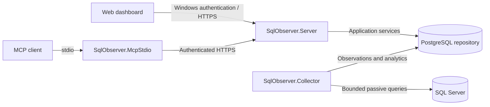

# SqlObserver

**SQL Server monitoring and diagnostics, with historical evidence in one place.**

SqlObserver is a Windows-hosted platform for understanding SQL Server health, investigating slow queries and blocking, and reviewing what changed over time. It collects bounded telemetry remotely, stores observations in PostgreSQL, and presents them through a React dashboard and authenticated API.

[Capabilities](#capabilities) · [Architecture](#architecture) · [Getting started](#getting-started) · [Documentation](#documentation) · [Contributing](#contributing)

> **Pre-release:** Milestones 0 through 11 are implemented locally, with reports, export contracts, and release tooling under M12. Production support, installer lifecycle validation, and full platform certification remain incomplete. Passing local tests does not certify a release.

## Capabilities

| Area | What you can inspect |
| --- | --- |
| **Overview** | Fleet and selected-server health, historical charts, database activity, resource observations, and previous-period comparisons |
| **Activity** | Sessions, requests, waits, blocking, and paginated history |
| **Query performance** | Query Store observations and bounded DMV fallback evidence |
| **Deadlocks** | Passive collection of system-health deadlock evidence and investigation views |
| **Operational health** | Backup status, SQL Agent failures, TempDB, and Availability Groups |
| **Host and replication** | Host metrics, replication status, and explicit visibility gaps |
| **Alerts** | Alert evaluation, maintenance windows, notification handling, and audited administration |
| **Analytics** | Rollups, baselines, forecasts, incident correlation, evidence packets, and backfill job inventory |
| **Reports** | Bounded, target-scoped reporting with HTML and CSV export contracts; release certification is pending |
| **MCP integration** | Authenticated, audited access through a reviewed catalog of 25 read-only diagnostic tools |

The dashboard supports preset and custom UTC time ranges. Evidence views expose freshness, partial coverage, and unavailable data so missing observations are distinguishable from healthy results. Backfill jobs rebuild analytics from retained observations; retention controls remain disabled by default.

### Monitoring boundaries

- **Remote collection:** no agent is installed on monitored SQL Server hosts by default.
- **Passive monitoring:** collectors do not change Query Store, Extended Events, indexes, plans, sessions, or server configuration.
- **Least privilege:** Windows integrated authentication, application RBAC, and target-scoped reads define access.
- **Bounded collection:** queries and API operations enforce limits on time, rows, and payload size.
- **Explicit administration:** enhanced monitoring setup is delivered as a separate, reviewable DBA-run script and is never applied automatically.
- **Sensitive evidence:** query text, plans, object names, XML, and errors are treated as sensitive, untrusted data. Neither the API nor MCP provides an arbitrary SQL console.
- **UTC storage:** persisted timestamps use UTC.

SqlObserver is an original, clean-room implementation. See the [product boundary](docs/product/clean-room-boundary.md) and [security policy](SECURITY.md).

## Architecture

The product is a modular monolith with separately deployable .NET processes and a React/TypeScript client. PostgreSQL is the application's repository; SQL Server is the monitored engine.



| Component | Responsibility |
| --- | --- |
| `SqlObserver.Server` | ASP.NET Core API, web assets, SignalR, authentication, authorization, reports, and MCP HTTP endpoint |
| `SqlObserver.Collector` | Scheduling, collection, ingestion, alerts, analytics, partition maintenance, and retention |
| `SqlObserver.McpStdio` | Local bridge to the server; no direct repository or monitored-target connection |
| PostgreSQL 18.x | Configuration, telemetry, analytics, alert state, reporting data, and audit records |
| React / TypeScript | Browser dashboard and investigation workflows |

The API reads diagnostic evidence through application services and the repository. The collector owns monitored-target connections. PostgreSQL-backed leases coordinate background workers.

See the [architecture overview](docs/architecture/overview.md), [architecture decisions](docs/adr/ADR-0001-modular-monolith.md), and [threat model](docs/architecture/threat-model.md).

## Getting started

### 1. Prepare a development environment

Use a Windows development workstation or an isolated Windows Server lab with:

- **.NET 10 SDK**, resolved from [`global.json`](global.json).
- **Node.js 22.22.0 or newer** and **pnpm 11.19.0**, as declared in [`web/package.json`](web/package.json).
- **PowerShell Core 7.5+** (`pwsh`). Windows PowerShell 5.1 and pwsh 7.4 are unsupported for repository validation.
- **Git**.

Live PostgreSQL integration tests additionally require the pinned PostgreSQL 18.4 environment, including Docker with Linux containers for container-backed tests. Live SQL Server tests require the configured Windows authentication and SQL Server lab environment. These external environments are not required for the default environment-independent Local checks.

### 2. Clone and validate

```powershell
git clone https://github.com/laminblake2025/SqlObserver.git
Set-Location SqlObserver
pwsh ./tools/validate.ps1 -Profile Local
```

The validator checks repository contracts and migration checksums, restores locked dependencies, builds .NET projects with warnings treated as errors, runs the Local test selection, typechecks the frontend, and builds and verifies web assets.

| Profile | Purpose |
| --- | --- |
| `Local` | Contributor validation. Runs local and environment-independent checks; reports omitted external certification lanes. |
| `Release` | Certification workflow. Requires configured external environments and verified evidence for the relevant lanes. Missing or malformed inputs fail preflight. |

Local environment inputs use `SQLOBSERVER_LOCAL_POSTGRES` and `SQLOBSERVER_LOCAL_SQLSERVER`. Release inputs use `SQLOBSERVER_RELEASE_POSTGRES` and `SQLOBSERVER_RELEASE_SQLSERVER`, plus the browser, installer, signing, and certification-manifest settings described in the [release preflight guide](docs/runbooks/m12-release-preflight.md). Keep connection values and credentials outside version control.

### 3. Run an isolated lab

Follow the [single-host lab deployment guide](docs/deployment/lab-single-host.md) for host preparation, service identities, repository setup, TLS, and serving a reviewed web build. Development helpers are not production installers. Use disposable test environments for synthetic workloads.

The initial platform targets are Windows Server 2022/2025, SQL Server 2019/2022/2025 on Windows, PostgreSQL 18.x, and Edge/Chrome. Qualification details and planned platforms are tracked in the [support matrix](docs/architecture/support-matrix.md).

## Project status

| Milestone | Implemented scope |
| --- | --- |
| M0–M4 | Architecture, PostgreSQL repository, onboarding, capability discovery, and collector foundations |
| M5 activity | Sessions, requests, waits, blocking, and history |
| M6 deadlocks | Passive system-health deadlock collection and investigation |
| M7 Query Store | Query-performance collection and diagnostic views |
| M8 | Alerting, maintenance, notifications, and audited administration |
| M9 operational-health | Backups, SQL Agent failures, TempDB, and Availability Groups |
| M10 | Host/replication evidence, analytics, incidents, backfill, and retention controls |
| M11 MCP | Authenticated, authorized, bounded, audited read-only diagnostic access |
| M12 | Reports, export contracts, observability, installer contracts, and certification tooling; external release evidence remains incomplete |

Recent repairs improve Overview reads, query collection, analytics transactions, backfill completion and cursor handling, retention function access, and consistent time-range selection. New database corrections are delivered through forward migrations 0073–0077.

### Collector catalog

The 15 runtime-registered collectors, in execution order, are `engine.core`, `database.inventory`, `database.files`, `activity.sessions`, `activity.requests`, `waits.server`, `blocking.current`, `deadlocks.system-health`, `queries.performance`, `backups.status`, `sql-agent.failures`, `tempdb.health`, `availability-groups.health`, `host.metrics`, and `replication.health`.

`capability.connection` is control-plane discovery and is not a scheduled collector. Capabilities and permissions determine which collectors can run; unsupported and degraded states remain visible.

## Repository map

| Path | Contents |
| --- | --- |
| [`src/`](src/) | .NET domain, application, infrastructure, features, and executable hosts |
| [`web/`](web/) | React/TypeScript dashboard and frontend tests |
| [`database/`](database/) | Numbered migrations, checksums, SQL objects, and non-production test data |
| [`collectors/`](collectors/) | Collector manifests and fixed, bounded SQL Server statements |
| [`tests/`](tests/) | Unit, integration, API/MCP contract, security, performance, and end-to-end tests |
| [`installer/`](installer/) | Packaging assets and installer contracts under development |
| [`release/certification/`](release/certification/) | Versioned certification matrix, contracts, and evidence policy |
| [`tools/`](tools/) | Validation, certification helpers, and opt-in lab tooling |
| [`docs/`](docs/) | Architecture, milestones, deployment guides, and operator runbooks |

## Documentation

- [Architecture and process boundaries](docs/architecture/overview.md)
- [Platform scope and qualification](docs/architecture/support-matrix.md)
- [Lab deployment](docs/deployment/lab-single-host.md)
- [Local development, browser fixtures, and PostgreSQL tests](docs/development.md)
- [Operator runbooks](docs/runbooks/README.md)
- [M12 release and certification status](docs/milestones/M12-reports-installer-release.md)
- [Backlog and milestone dependencies](BACKLOG.md)
- [Security policy and vulnerability reporting](SECURITY.md)

## Contributing

Read [CONTRIBUTING.md](CONTRIBUTING.md) before changing code. Include focused tests, preserve bounded passive monitoring and least-privilege access, and document migration or compatibility effects. Run the canonical validator and report which external environments were exercised.

Do not commit credentials, captured customer diagnostics, build outputs, or dependency caches. Report suspected vulnerabilities through the private process in [SECURITY.md](SECURITY.md).
