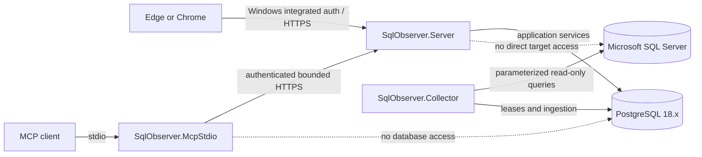

# SqlObserver

M9 operational health assets (backups, SQL Agent failures, TempDB, and Availability Groups) are implemented locally with certification pending. They use passive, checksum-pinned SQL and target-scoped bounded projections; no backup, job, TempDB, or AG mutation is performed.

SqlObserver is a clean-room, Windows-hosted monitoring and diagnostics product for Microsoft SQL Server. It is intended to collect bounded, historical evidence without installing an agent on monitored database hosts by default. PostgreSQL 18.x is the product's application repository; it is not a monitored database engine.

> **Repository status:** Milestones 0 through 9 are implemented locally. M5 activity, M6 deadlock, and M7 Query Store slices are bounded and passive. M8 adds fenced deterministic alert evaluation, maintenance suppression, durable notification outbox delivery, audited administration, and target-scoped active-alert API/web projections; M9 adds bounded operational-health projections for backups, SQL Agent failures, TempDB, and Availability Groups. PostgreSQL integration execution requires Docker/PostgreSQL 18.4 and SQL Server lab execution requires the configured Windows/SSPI environment; SqlObserver is not yet a supported release, and installers/release/platform certification remain later milestones.

## Product boundary

SqlObserver is designed to provide historical telemetry, query diagnostics, wait and blocking analysis, deadlock evidence, alerts, baselines, reports, forecasts, and incident correlation. Its eventual MCP surface is an allowlisted, read-only diagnostic interface.

The boundary is deliberately narrow:

- monitored engines are Microsoft SQL Server; PostgreSQL stores SqlObserver configuration and observations;
- default monitoring is remote and agentless;
- passive monitoring does not alter a monitored SQL Server instance;
- any enhanced monitoring configuration is delivered separately as a reviewable, DBA-run script and is never applied automatically;
- neither the web API nor MCP is a general-purpose SQL console;
- query text, plans, object names, comments, errors, XML, and job steps are sensitive, untrusted data;
- all persisted timestamps use UTC.

The implementation is original. See [the clean-room boundary](docs/product/clean-room-boundary.md) and [ADR-0009](docs/adr/ADR-0009-clean-room-boundary.md).

## Architecture

SqlObserver is a modular monolith with three separately deployable .NET processes and a React/TypeScript client:

| Process | Responsibility |
| --- | --- |
| `SqlObserver.Server` | ASP.NET Core API, web assets, SignalR, Windows authentication, RBAC, reports, and the MCP HTTP endpoint |
| `SqlObserver.Collector` | Windows Worker Service for scheduling, bounded collection, ingestion, alert evaluation, rollups, baselines, partition care, and retention |
| `SqlObserver.McpStdio` | Local MCP stdio bridge that authenticates to `SqlObserver.Server`; it has no database or target connection |
| PostgreSQL 18.x | Configuration, security metadata, telemetry, analytics, alert state, reporting data, and audit records |

Code is separated into domain, application, infrastructure, collector, analysis, security, audit, and host projects while remaining one product and one release train. PostgreSQL-backed leases coordinate workers before any separate broker is considered.



More detail is in [the architecture overview](docs/architecture/overview.md), [support matrix](docs/architecture/support-matrix.md), and [threat model](docs/architecture/threat-model.md).

## Quick start for contributors

The current quick start validates the architecture/bootstrap work, the M2 PostgreSQL repository, the M3 onboarding/capability slice, the M4 collector/core-health vertical slice, the M5 sessions/requests/waits/blocking activity slice, the M6 passive system-health deadlock slice, the M7 passive Query Store/query-performance slice, and the M9 passive operational-health slice.

Prerequisites:

- Windows Server 2022/2025, or a Windows development workstation used only as an uncertified build host;
- .NET 10 SDK;
- a Node.js release supported by the checked-in frontend toolchain and its lockfile;
- pnpm 11.19.0, as pinned by `web/package.json` and CI;
- PowerShell 7 (`pwsh`);
- Git;
- Docker Desktop using Linux containers, with access to the pinned PostgreSQL 18.4 image used by the active integration suite.

From the repository root, run:

```powershell
pwsh ./tools/validate.ps1
```

The validation entry point restores locked dependencies, compiles with warnings treated as errors, runs all active tests (including an ephemeral PostgreSQL 18.4 repository and the available SQL Server development lab), builds the strict TypeScript frontend, and performs repository-policy checks. Test projects for later milestones remain explicitly skipped until their owning runtime slices are implemented; completed-milestone suites have no skips.

Do not provision production credentials or point this repository slice at a production SQL Server. Development setup scripts are not production installers.

## Repository map

| Path | Purpose |
| --- | --- |
| `src/` | .NET domain, application, infrastructure, feature libraries, and executable hosts |
| `web/` | Strict React/TypeScript client skeleton; feature UI begins in M3 |
| `database/migrations/` | Immutable, numbered PostgreSQL SQL migrations and checksum manifest |
| `database/functions/`, `database/views/` | Review indexes for SQL-first objects deployed by numbered migrations |
| `database/seeds/`, `database/testdata/` | Non-production reference and test inputs |
| `collectors/manifests/` | Versioned collector metadata contracts |
| `collectors/sql/` | Versioned, fixed, bounded SQL Server collection statements |
| `installer/wix/`, `installer/postgres/` | Future Windows and PostgreSQL packaging |
| `tests/` | Unit, integration, contract, security, performance, and end-to-end suites |
| `docs/architecture/` | Architecture, support policy, and threat model |
| `docs/adr/` | Architecture decision records |
| `docs/product/` | Product vocabulary and clean-room rules |
| `docs/runbooks/` | Future operator procedures; no runtime runbooks exist yet |
| `tools/` | Canonical repository validation and staged local-development helpers |
| `.github/workflows/` | Continuous integration definitions |

## Milestone scope

Milestone 0 establishes the product boundary, architecture, support posture, threat model, terminology, and decisions. Milestone 1 adds compilable/buildable skeletons, validation plumbing, directory placeholders, and local-runner CI. Milestone 2 adds the PostgreSQL 18 repository foundation. Milestone 3 adds credential-free target onboarding, SID-based RBAC, integrated identity, bounded capability discovery, and offline least-privilege permission plans. Milestone 4 adds the fenced scheduler, retry/circuit/loss accounting, three passive core-health collectors, atomic ingestion, and scoped health projections. Milestone 5 adds bounded sessions, requests, waits, current blocking, blocking history, and the target activity surface. Milestone 6 adds passive system-health deadlock evidence with privacy-minimized typed projections. Milestone 7 adds bounded passive Query Store/query-performance evidence, explicit plan-cache fallback, history/top/plan metadata projections, and the read-only target panel. Milestone 8 adds deterministic metric-threshold and collector-health alerts, one-off UTC maintenance, fenced state/history/outbox delivery, and audited administrative APIs. Milestone 9 adds bounded passive operational-health projections for backups, SQL Agent failures, TempDB, and Availability Groups. See the [M2 implementation record](docs/milestones/M2-postgresql-repository.md), [M3 implementation record](docs/milestones/M3-onboarding-and-capabilities.md), [M4 implementation record](docs/milestones/M4-collector-framework-and-core-health.md), [M5 implementation record](docs/milestones/M5-sessions-requests-waits-blocking.md), [M6 implementation record](docs/milestones/M6-deadlocks-and-extended-events.md), [M7 implementation record](docs/milestones/M7-query-store-query-performance.md), [M8 implementation record](docs/milestones/M8-alerts-maintenance-notifications.md), [M9 implementation record](docs/milestones/M9-operational-health.md), and [BACKLOG.md](BACKLOG.md).

The implemented and runtime-registered target collectors (execution order 1–13) are `engine.core`, `database.inventory`, `database.files`, `activity.sessions`, `activity.requests`, `waits.server`, `blocking.current`, `deadlocks.system-health`, `queries.performance`, `backups.status`, `sql-agent.failures`, `tempdb.health`, and `availability-groups.health`. `capability.connection` is control-plane discovery and is not a scheduled collector. M5–M9 evidence is bounded, passive, target-scoped, and exposes explicit freshness/loss evidence. M9 API cursors are opaque, target/run/revision bound, and limited to 1 KiB; SQL Agent filtering uses UTC first-observed windows and never exposes job text, messages, commands, or source-local-time conversion. No collector mutates a monitored target. Docker/live SQL certification, deployment, upgrade behavior, and release/platform certification remain incomplete.

## Non-goals through this milestone

- Collecting target data beyond the implemented bounded passive capability, core, database/files, activity, waits/blocking, system-health deadlock, and query-performance collectors.
- Shipping an MCP server or any `execute_sql`-style capability.
- Changing Query Store, Extended Events, blocked-process settings, indexes, plans, sessions, or server configuration.
- Shipping an installer or claiming support certification.
- Reproducing another product's schema, API, user interface, wording, artwork, or internal behavior.

See [CONTRIBUTING.md](CONTRIBUTING.md) before making changes and [SECURITY.md](SECURITY.md) for the rules that all later milestones must preserve.
