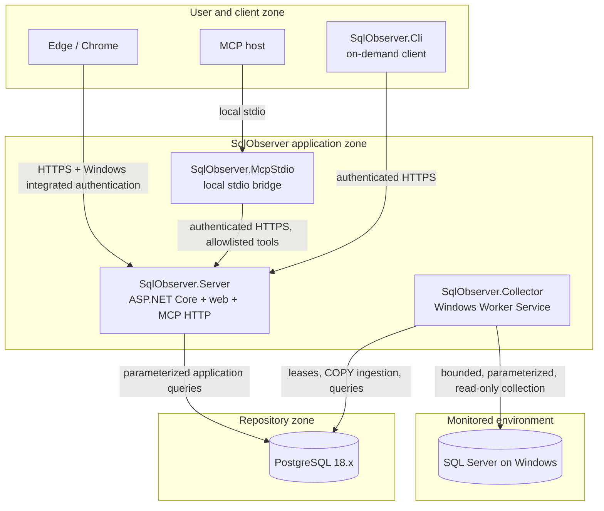

# Architecture overview

## Scope and status

This document fixes the product architecture and records the implementation boundary through Milestone 11. Repository, onboarding, collection, diagnostic, alerting, analytics, and the fixed read-only MCP surface have local evidence. Reports, packaging, deployment lifecycle, and support certification remain M12 work and must not be inferred from this topology.

SqlObserver is a Windows Server-hosted, agentless-by-default diagnostics application for Microsoft SQL Server. PostgreSQL 18.x is the application repository. The design is a modular monolith: modules share domain and application contracts, while independently hosted processes have narrow responsibilities and can be deployed separately.

## Runtime topology



The server does not connect to monitored SQL Server instances. The MCP bridge does not connect to PostgreSQL or a monitored target. MCP requests enter through the same authenticated, authorized, bounded application services used by the API.

## Processes

### `SqlObserver.Server`

The ASP.NET Core host serves API endpoints, built web assets, reports, Windows Integrated Authentication, role-based authorization, and the MCP-over-HTTP adapter. The browser refreshes diagnostic evidence through bounded API reads; SignalR updates remain planned. The host owns presentation and transport concerns but delegates policy and query behavior to application services. Administrative writes and every MCP invocation are audited.

### `SqlObserver.Collector`

The Windows Worker Service schedules and executes collector contracts, discovers target capabilities, ingests batches, evaluates alerts, computes rollups and baselines, and maintains repository partitions. Its retention worker runs one policy-gated detach or drop per fenced lease and records a system audit actor. SecurityAdministrator retention operations remain a separate, audited path. PostgreSQL leases prevent overlapping ownership across worker processes. A target/collector pair never overlaps, and each execution is cancellable and bounded by timeout, rows, bytes, and estimated cost.

The default target path is passive and read-only. The worker cannot grant itself target permissions or apply enhanced setup.

### `SqlObserver.McpStdio`

The local bridge translates stdio protocol messages through an adapter and authenticates to the server. It contains no domain data access and receives no database credential. Protocol SDK selection is deferred until Milestone 11 and must use the latest stable official C# SDK verified at that time. If 2.x is still preview, the stable 1.x line is shipped and compatibility-tested against current/2.x protocol behavior.

### `SqlObserver.Cli`

The CLI is an on-demand administrative client boundary, not a Windows Service and not an offline database utility. Future commands must authenticate to `SqlObserver.Server` and use approved application services with the same RBAC, bounds, cancellation, and administrative-write audit as the web/API path. The CLI receives no PostgreSQL or observation-target credential and never executes target SQL directly. The current project is a no-command process scaffold; any future offline migration, installer, or break-glass authority requires explicit security review and an ADR before implementation.

### PostgreSQL 18.x repository

The repository holds configuration, authorization metadata, telemetry, events, derived analytics, alert state, report data, and audit records. The planned schemas are:

| Schema | Responsibility |
| --- | --- |
| `control` | Targets, capability profiles, schedules, policies, and worker leases |
| `security` | Application roles, bindings, protected-secret metadata, and access policy |
| `telemetry` | High-volume time-series observations |
| `events` | Deadlocks and other lower-volume diagnostic events |
| `analytics` | Rollups, baselines, forecasts, and correlations |
| `alerting` | Alert rules, evaluations, state transitions, and delivery state |
| `reporting` | Report definitions, bounded materializations, and export metadata |
| `audit` | MCP-call and administrative-write audit evidence |
| `system` | Repository version, migration checksums, partition catalog, and internal health |

Production schema changes are immutable, numbered SQL migrations with checksums; automatic ORM schema generation is prohibited. High-volume raw telemetry uses native daily range partitions. Lower-volume events use monthly partitions. BRIN indexes serve time-oriented scans and B-tree indexes serve justified instance/time access paths. High-volume metric and event ingestion uses PostgreSQL binary `COPY` into transaction-local staging. Sensitivity-controlled query text and plan storage remains planned; the collector currently marks that content unavailable. Repository observation times are UTC.

## Module boundaries

Dependencies point inward:

```text
Hosts (Server, Collector, MCP stdio, CLI)
  -> feature modules (Collectors, Alerting, Analytics, Security, Audit, MCP)
    -> Application use cases and ports
      -> Domain types and invariants

Infrastructure.PostgreSql / Infrastructure.SqlServer / Infrastructure.Windows
  implement application ports and are composed only by hosts.
```

Domain code has no dependency on database drivers, HTTP, Windows services, UI frameworks, or MCP SDKs. The MCP protocol is behind an adapter. Collector-specific SQL and manifests remain versioned, reviewable resources rather than hidden string fragments.

## Collection lifecycle

1. The worker obtains a short, renewable PostgreSQL lease for a scheduled target/collector key.
2. It begins an append-only, revision- and fence-bound run before target I/O; the next valid owner closes an abandoned run as a visible lease-loss gap.
3. Capability data and the collector manifest determine whether execution is supported and which documented fallback, if any, applies.
4. The worker opens a least-privilege target connection, applies statement/execution bounds, and runs a parameterized read-only query.
5. It validates and versions the output, records visible truncation or loss, and atomically ingests the bounded batch with its outcome and next schedule/circuit state.
6. Alert/analysis work consumes committed observations, not an unbounded in-memory side channel.
7. Outcome, duration, rows, bytes, retries, circuit state, and safe diagnostics are instrumented.
8. The worker releases or lets the lease expire; stale owners cannot commit work protected by a newer fencing value.

Failures degrade one collector or target without blocking unrelated schedules. Cancellation propagates through every I/O operation. Retry and circuit-breaker behavior is constrained by collector cost and deadline.

## Access and security model

- Prefer gMSA identities and Windows integrated authentication for unattended services and target access.
- The web uses Windows Integrated Authentication plus application RBAC; authenticated is not synonymous with authorized.
- Never require permanent `sysadmin`. Permissions are version- and capability-aware, independently reviewed, and tested for expected denial.
- Passive collection cannot change the target. Query Store and Extended Events are DBA controlled.
- Enhanced monitoring is a separate DBA-reviewed script and never an automatic repair path.
- Diagnostic content is sensitive and untrusted; encode on output, use hardened parsers, restrict access, limit retention, and keep unrestricted content out of logs.
- Parameterize all values; tightly allowlist identifiers in the exceptional paths where a driver cannot parameterize an identifier.
- Enforce time, row, byte, concurrency, and execution budgets in API, MCP, repository, and target operations.

See [SECURITY.md](../../SECURITY.md) and [the threat model](threat-model.md).

## Observability and operations

All services use structured logs and OpenTelemetry while excluding secrets and unrestricted SQL text. Required signals include collection lag, lease contention, target/repository latency, timeouts, retries, circuit state, queue/backlog depth, ingested and rejected rows/bytes, sample loss, alert-evaluation health, audit-write failures, and partition/retention state.

The four M12 supply-chain runbooks are versioned, documentation-only procedures with bounded ContractOnly and pending-lane evidence checks. They do not assert product readiness or support, and they do not execute catalog commands. Broader product and operational runbooks remain incomplete. [The runbook index](../runbooks/README.md) records the approved M12 scope.

## Evolution constraints

PostgreSQL-backed leases precede any broker. A broker, additional deployable process, new target write behavior, or expanded MCP authority requires a new ADR. Completed milestone behavior is not reshaped for convenience without updating its governing decision. Initial and planned platform claims are tracked in the [support matrix](support-matrix.md), and work is sequenced in [BACKLOG.md](../../BACKLOG.md).
