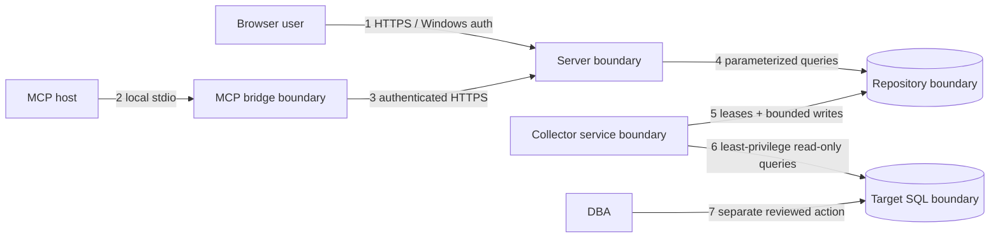

# Threat model

## Scope and assumptions

This threat model covers the intended SqlObserver processes, application repository, web and MCP entry points, and outbound collection connections. It is architectural at Milestone 0; later milestones must add implementation-specific abuse cases and test evidence.

Conservative assumptions:

- monitored SQL Server and diagnostic data are high-value assets;
- application, repository, target, administrator workstation, browser, and MCP host may occupy different trust zones;
- captured diagnostic content may be intentionally malicious;
- network paths can be observed or tampered with unless protected;
- an authenticated user, compromised service identity, dependency, or local MCP client may act maliciously;
- clocks can skew and processes can crash or pause during lease ownership;
- database and Windows administrators remain outside the product's technical control and are trusted only for actions their platform roles permit.

## Assets

| Asset | Security need |
| --- | --- |
| Target credentials and service identities | Confidentiality, least privilege, rotation, non-exportability |
| Repository credentials and encryption material | Confidentiality and narrow process access |
| Query text, plans, deadlocks, job steps, errors, object names | Confidentiality, integrity, bounded retention, safe rendering |
| Configuration and target inventory | Confidentiality and integrity |
| Telemetry, events, baselines, alerts, reports | Integrity, availability, tenant/scope authorization |
| RBAC policy and identity bindings | Integrity, auditability, fail-closed evaluation |
| Administrative and MCP audit evidence | Integrity, completeness, limited disclosure, durable UTC ordering |
| Collector schedules, capabilities, and leases | Integrity and availability |
| Application binaries, migrations, collector manifests/SQL | Integrity, provenance, reproducibility |

## Actors

- **Viewer/operator:** authenticated user with a bounded diagnostic role.
- **SqlObserver administrator:** can change application configuration but does not thereby receive target `sysadmin`.
- **Database administrator:** independently approves target grants and any enhanced setup script.
- **Service identities:** gMSA or other narrowly scoped identities for server, collector, and repository access.
- **MCP client/host:** potentially local but not inherently trusted; limited by server authentication and RBAC.
- **External attacker:** unauthenticated or operating through a compromised endpoint/network path.
- **Malicious or compromised insider:** has some valid application, Windows, PostgreSQL, or SQL Server access.
- **Supply-chain actor:** can influence a dependency, build input, package, or update source.
- **Monitored workload:** can cause hostile strings/XML/plans and extreme data volumes to appear in supported diagnostic interfaces.

## Trust boundaries and data flows

1. Browser requests cross from a user workstation into the web/API host. Windows authentication establishes identity; application RBAC authorizes each resource and field.
2. MCP protocol input crosses from an MCP host into a local adapter and is untrusted even over stdio.
3. The bridge authenticates to the server; it cannot bypass service-layer authorization and limits.
4. Server reads and administrative writes cross into PostgreSQL through application ports using parameterized SQL.
5. Collectors acquire fenced leases and ingest validated, schema-versioned batches. Repository data can contain hostile target content.
6. Collection crosses into monitored environments using version-aware, least-privilege, read-only credentials and documented SQL Server APIs.
7. Enhanced monitoring changes, if offered, cross a human approval boundary: a DBA separately reviews and runs the script. SqlObserver does not execute it.

There is intentionally no Server-to-target, MCP-to-repository, or MCP-to-target flow.

## Threats and mitigations

| Threat | Primary mitigations | Verification direction |
| --- | --- | --- |
| Credential theft from configuration, logs, traces, or errors | gMSA/integrated auth preference; protected secret store; non-exportable access where possible; allowlisted structured fields; pre-serialization redaction | Secret scanning, log/trace fixtures, access-control tests, rotation exercise |
| Excess target privilege or privilege creep | No permanent `sysadmin`; manifest-declared permissions; version-aware generated grants; DBA review; expected-denial tests | Per-version permission matrix and negative integration tests |
| Target mutation through passive collection | Read-only application contract; supported read interfaces; SQL review; separate enhanced script; no self-grant/repair | Query/static policy checks and target state comparison before/after tests |
| SQL injection against target or repository | Parameterized values; strict identifier allowlists; no arbitrary-SQL API/MCP tool | Injection corpus, code analysis, contract tests |
| MCP used as a control plane or data bypass | Fixed read-only allowlist; service-layer reads; normal RBAC; no direct credentials; no state-changing tools; audit every call | Tool inventory snapshot, authorization/limit/audit contract tests |
| Authorization bypass or confused deputy | Windows authentication plus server-side RBAC; audience-bound service identities; object-scope checks; deny by default | Cross-role/cross-scope tests and denied-attempt audits |
| Stored or reflected script/markup injection | Treat diagnostic text/XML as untrusted; inert rendering; context encoding; safe XML parser; sanitize derived graphics | Malicious query/plan/deadlock fixtures and browser security tests |
| Prompt injection through captured diagnostic text | Never interpret captured text as instruction; isolate it as quoted data; allowlisted MCP tools unaffected by content | Adversarial MCP/query-text contract tests |
| XML entity expansion, external retrieval, or parser exhaustion | Disable DTD/external entities/network resolution; byte/depth/time bounds; parse defensively | XXE, entity expansion, depth, and oversized payload tests |
| Resource exhaustion from costly queries or huge payloads | Collector/API/MCP time, row, byte, execution and concurrency bounds; statement timeouts; cancellation; circuit breakers; pagination | Timeout, cancellation, saturation, and payload-limit tests |
| Silent sample loss or misleading health | Explicit truncation/loss metadata; collection lag and rejection metrics; failure state surfaced; no hidden sampling | Fault injection, saturation tests, user-visible degraded-state checks |
| Duplicate or overlapping collection | PostgreSQL leases with expiry and fencing token; target/collector key; idempotent ingestion identity | Crash, pause, skew, renewal, stale-writer, and concurrency tests |
| Lease/repository outage halts collection | Fail closed on ownership uncertainty; bounded recovery/backoff; visible backlog and lease health | Repository partition/network fault tests |
| Tampering with telemetry or audit | Narrow write roles; append-oriented audit design; integrity controls/backups; safe correlation IDs; monitor audit failures | Role tests, tamper detection, restore and audit-failure exercises |
| Retention failure or partition accident | Declarative policy; preview/dry-run; bounded partition operations; backups; audit; no broad destructive target | Boundary-date, recovery, and least-privilege repository tests |
| Malicious package, migration, collector SQL, or build input | Reviewed pinned dependencies; central management; checksums; immutable migrations; provenance and CI policy | Dependency review, checksum verification, clean build |
| Transport interception or server spoofing | TLS with validated identity; Kerberos/service principal correctness; no insecure fallback | Certificate, downgrade, and SPN tests |
| Cross-environment data disclosure | Separate identities/configuration and repository boundaries; explicit environment labeling; no production data in tests | Deployment review and isolation tests |

## Security invariants

- Passive monitoring causes no target state change.
- Target access never depends on permanent `sysadmin`.
- Query Store, Extended Events, and blocked-process configuration are never changed automatically.
- MCP has no arbitrary execution or administrative side effect and no database credential.
- Every MCP call and administrative write is audited without copying unrestricted sensitive content into audit storage.
- Limits and cancellation exist at every externally driven resource boundary.
- All diagnostic strings and structured plans/XML remain data, never instructions.
- All persisted timestamps are UTC.

## Residual risks

Even least-privilege diagnostic access can reveal schema and workload details. Repository compromise can expose retained data and falsify analysis unless infrastructure protections and backup integrity are strong. Windows and database administrators can act outside SqlObserver controls. Integrated authentication depends on correct Active Directory, SPN, delegation, and host configuration. Passive diagnostic queries may still impose measurable load, especially under target distress. Source interfaces such as `system_health` can change across engine updates. Bounds may trade completeness for safety, so truncation must remain visible. A central repository and lease service are availability dependencies. No control eliminates risk from a fully compromised application host.

Later milestones must assign owners, measurable limits, tests, and monitoring to these risks. Deployment documentation must not imply that SqlObserver replaces network segmentation, endpoint protection, SQL Server auditing, database backups, or incident response.
