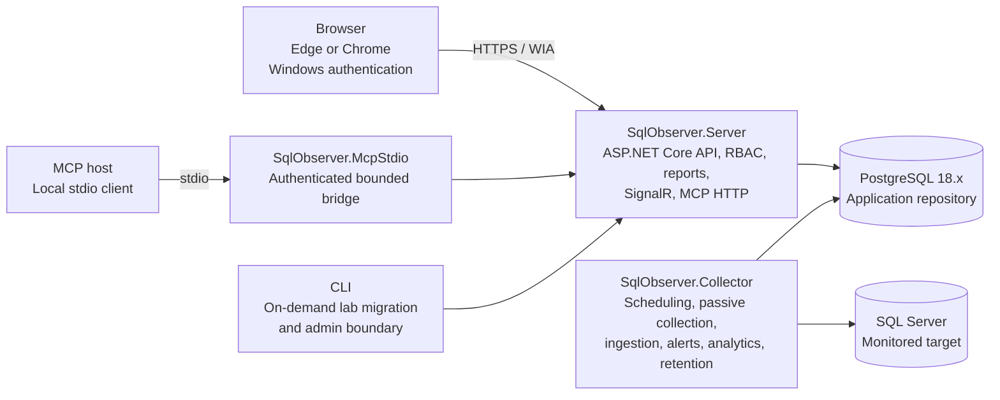

**TECHNICAL PROJECT HANDOFF**

# SqlObserver Technical Project Overview

*Architecture, deployed lab status, live browser validation, and M12 roadmap*

**As of:** September 4, 2026

**Repository:** [github.com/laminblake2025/SqlObserver](https://github.com/laminblake2025/SqlObserver)

**Baseline:** main @ 5387e8e7233c4edf13492497f74b2da8106330a5

**Audience:** Maintainers, lab operators, security reviewers, and release engineering

**Classification:** Internal engineering - lab / pre-release

> **Current position:** Milestones 0-11 are implemented. M12 now has a working single-host lab deployment at merge commit 5387e8e. HTTPS/Negotiate/RBAC, target lifecycle, core engine health, database inventory, and alerts are verified. Browser/API contracts, logical-file collection, activity, and report generation still need remediation. SqlObserver remains pre-release and unsupported.

## Executive summary

SqlObserver is a clean-room, Windows-hosted, agentless-by-default monitoring and diagnostics system for Microsoft SQL Server. PostgreSQL 18.x is the application repository; it is not itself a monitored engine. The codebase is a modular monolith with separately deployable Server, Collector, MCP stdio bridge, and CLI boundaries plus a React/TypeScript client.

- The solution contains 18 source projects and 9 test projects, all on the .NET 10 toolchain, plus a React 19 / TypeScript 7 / Vite 8 frontend.

- The Collector implements 15 scheduled, checksum-pinned collectors across core health, database inventory, activity, waits, blocking, deadlocks, query performance, operational health, host metrics, and replication health.

- The default target posture is passive and read-only. Server never connects directly to a monitored SQL Server, and the MCP bridge has neither a PostgreSQL credential nor a target credential.

- Merged-baseline checks passed: locked restore, Release build, focused .NET/Node suites, five M12 ContractOnly producers, and a valid 20-lane / 35-case matrix. External and live support cases remain pending.

- The Windows Server 2025 lab runs PostgreSQL 18.6 (migrations 0001-0023), SQL Server 2025, and commit-named Server, Collector, Web, and MCP artifacts at https://WIN-QNGOV5GDM24:5443/.

- Browser validation passed authentication, authorization, target lifecycle, core health, inventory, and alerts. It exposed canonical-UTC, address-rendering, logical-file, activity, and report-generation defects; these are the immediate engineering gates.

## 1. Purpose, scope, and status language

This document consolidates the repository architecture, completed milestone behavior, M12 hardening work, the deployed disposable lab, live browser/API findings, and the recommended milestone sequence. It is a point-in-time handoff, not a replacement for the versioned ADRs, migration files, certification schemas, or deployment runbooks.

| Term | Meaning in this document |
| --- | --- |
| Designed | Recorded in architecture or a proposed ADR; implementation or qualification may still be absent. |
| Implemented locally | Code and local tests exist on main; this does not imply a live platform or support claim. |
| Verified on this lab | Observed on WIN-QNGOV5GDM24 during this engagement at the baseline commit. |
| Pending | Required owner decision, external environment evidence, packaging, or qualification is missing. |
| Supported | A release documentation claim after every applicable M12 gate passes. This state has not been reached. |

### 1.1 Snapshot metadata

| Area | Point-in-time state | Status |
| --- | --- | --- |
| Source control | GitHub main at 5387e8e...; PR #57 merged; lab checkout clean | Verified |
| Milestones | M0-M11 locally implemented; M12 live-runtime remediation and certification in progress | In progress |
| Repository | PostgreSQL 18.6, exact migration ledger 0001-0023 | Verified on lab |
| Target engine | SQL Server 2025 (major 17) Developer Edition on Windows | Verified on lab |
| Runtime | Server, Collector, and Web running from commit-named directories; MCP published | Running on lab |
| Web | HTTPS, Negotiate, RBAC, target list, core health, inventory, and alerts pass; contract defects remain | Partial |
| Release | Matrix valid at 20 lanes / 35 cases; required external/live cases remain pending | Not supported |

## 2. System architecture

SqlObserver uses a modular-monolith code model and separates runtime authority through independently deployable hosts. Domain and application rules remain shared, while infrastructure adapters implement narrow ports for PostgreSQL, SQL Server, and Windows.



*Figure 1. Runtime authority and data-flow boundaries.*

- Browser and API traffic terminates at SqlObserver.Server, which performs Windows authentication, application RBAC, target scoping, and bounded application-service calls.

- SqlObserver.Collector is the only product process that connects to monitored SQL Server targets. Its SQL is versioned, fixed, bounded, and passive by default.

- SqlObserver.McpStdio is an authenticated transport bridge to the Server. It does not connect to PostgreSQL or SQL Server.

- PostgreSQL coordinates worker leases and stores configuration, telemetry, events, analytics, alert state, reporting data, and audit evidence.

- A separate broker, additional deployable process, expanded MCP authority, or target-write behavior requires a new ADR.

### 2.1 Runtime process responsibilities

| Process | Responsibilities | Credential boundary |
| --- | --- | --- |
| SqlObserver.Server | ASP.NET Core API, web boundary, SignalR, Windows authentication, RBAC, reports, MCP HTTP, administrative audit | Server-only PostgreSQL login; no monitored-target credential |
| SqlObserver.Collector | Scheduling, capability discovery, bounded collection, ingestion, alerts, rollups, baselines, partitions, retention | Collector-only PostgreSQL login plus dedicated Windows target identity |
| SqlObserver.McpStdio | Local stdio protocol adapter that calls Server through the reviewed MCP surface | No database or target credential |
| SqlObserver.Cli | On-demand administrative boundary; currently includes the closed single-host lab PostgreSQL migration command | Hidden-input bootstrap credential for the fixed loopback lab command only |

### 2.2 Module direction

```text
Hosts: Server | Collector | McpStdio | Cli
  -> Feature modules: Collectors | Alerting | Analytics | Reporting | Security | Audit | MCP | Observability
    -> Application use cases and ports
      -> Domain types and invariants

Infrastructure.PostgreSql | Infrastructure.SqlServer | Infrastructure.Windows
  implement application ports and are composed only by hosts.
```

The domain layer does not depend on database drivers, HTTP, Windows services, UI frameworks, or MCP SDKs. This keeps authorization, bounds, identities, and state transitions testable without host infrastructure.

## 3. Repository and data architecture

PostgreSQL is the sole application repository for the initial release. The database is SQL-first: immutable numbered migrations define schemas, functions, grants, partitions, and indexes; automatic ORM schema generation is prohibited.

| Schema | Responsibility |
| --- | --- |
| control | Targets, capability profiles, schedules, policies, collector state, worker leases |
| security | Application roles, bindings, protected-secret metadata, and access policy |
| telemetry | High-volume time-series observations and bounded ingestion |
| events | Deadlocks and other lower-volume diagnostic events |
| analytics | Rollups, baselines, forecasts, correlations, and incident evidence |
| alerting | Alert definitions, evaluation, state transition, and delivery state |
| reporting | Four fixed report definitions, immutable materializations, and export metadata |
| audit | MCP invocation and administrative-write audit records |
| system | Migration ledger, repository version, partition catalog, and internal health |

### 3.1 Migration discipline

- Only database/migrations/NNNN_name.sql files are deployable; review-index files under database/functions and database/views are not a second deployment source.

- The runner requires a contiguous catalog, verifies the lowercase SHA-256 manifest, obtains an advisory lock, and validates the existing ledger as an exact prefix.

- Each migration and its system.schema_migration ledger row commit atomically. Any gap, unknown row, reordering, or checksum mismatch fails closed.

- Released migrations are immutable. Forward fixes use new numbered migrations; migration 0023 is the current example.

- All stored instants use UTC. Raw telemetry partitions by UTC day; lower-volume events partition by UTC month.

> **Operator rule:** Do not apply repository migrations individually with psql -f. That bypasses the application runner's advisory lock, checksum verification, exact-prefix validation, and atomic ledger contract.

### 3.2 PostgreSQL role boundary

| Role / login | Purpose | Important limits |
| --- | --- | --- |
| sqlobserver_bootstrap | Creates the empty database, roles, and applies reviewed migrations | Separate credential; not used by runtime processes |
| sqlobserver_migrator | NOLOGIN owner role for repository objects and migrations | No runtime membership |
| sqlobserver_server + login | Bounded reads and append-only audit from Server | No collector writes, migration authority, or target access |
| sqlobserver_collector + login | Lease, collection, ingestion, alert, analytics, partition, and retention functions | No direct report_run access after 0023; no migration authority |
| sqlobserver_report_expirer | Fixed NOLOGIN owner of the forced-RLS report expiry function | Narrow SELECT/UPDATE/DELETE on reporting.report_run; no login |
| sqlobserver_auditor | Read-only access to append-only activity audit | Not granted to Server or Collector runtime logins |

## 4. Collection model and implemented diagnostic surface

### 4.1 Collection lifecycle

1. Acquire a short, renewable PostgreSQL lease for the target/collector work key and obtain a monotonically increasing fencing token.

1. Create an append-only, target-revision- and fence-bound run before target I/O; abandoned work becomes visible loss evidence.

1. Use the target capability profile and collector manifest to select only an explicitly supported SQL Server version and fallback.

1. Open a least-privilege Windows-integrated target connection with validated encryption and explicit execution bounds.

1. Execute a fixed parameterized read-only query and enforce timeout, row, byte, concurrency, and cost ceilings.

1. Validate and atomically ingest the typed output, completion digest, schedule state, circuit state, and truncation/loss evidence.

1. Evaluate alerts and analytics from committed repository evidence rather than an unbounded in-memory side channel.

1. Release or expire the lease; stale owners cannot commit work after a newer fencing value exists.

### 4.2 Scheduled collectors

| Order | Collector ID | Primary evidence |
| --- | --- | --- |
| 1 | engine.core | Instance identity and core engine health |
| 2 | database.inventory | Database inventory and state |
| 3 | database.files | Logical database-file health |
| 4 | activity.sessions | Bounded active session metadata |
| 5 | activity.requests | Bounded active request metadata |
| 6 | waits.server | Server wait evidence |
| 7 | blocking.current | Current blocking evidence |
| 8 | deadlocks.system-health | Typed deadlock evidence from the existing system_health session |
| 9 | queries.performance | Query Store / plan-cache performance metadata without query text or plans |
| 10 | backups.status | Backup recency and status |
| 11 | sql-agent.failures | SQL Agent failure occurrence evidence without job commands/messages |
| 12 | tempdb.health | TempDB configuration and pressure evidence |
| 13 | availability-groups.health | Availability Group health when supported |
| 14 | host.metrics | Windows host observations under an explicit host binding |
| 15 | replication.health | Replication health when explicitly configured |

capability.connection is the separate control-plane discovery contract and is not a scheduled collector. It discovers normalized version, platform, transport, authentication, and permission evidence without changing the target.

### 4.3 Passive versus enhanced monitoring

| Mode | Behavior | Authority |
| --- | --- | --- |
| Passive (default) | Supported catalog views, DMVs, functions, and existing system sessions only; no target mutation | Collector may run only after capability and least-privilege checks |
| Enhanced (future / explicit) | Separately versioned DBA-reviewed setup for richer evidence such as a dedicated XE session | DBA chooses and runs the script; SqlObserver never auto-applies or repairs it |

## 5. API, web, MCP, reporting, and exports

### 5.1 API and web

- The deployed Server uses Windows Integrated Authentication and application RBAC. HTTPS, the normal Negotiate challenge/retry, and role enforcement were verified from the management workstation.

- Target scope remains resolved at the application-service boundary before repository paging or projection. The lab target is visible and its lifecycle is Active.

- The Server now hosts the deterministic React production bundle and same-origin API on https://WIN-QNGOV5GDM24:5443/. Target list, engine health, database inventory, alerts, and the report form render through the deployed application.

- Because the lab is a workgroup deployment, Negotiate falls back to NTLM and reports authentication_scheme_fallback; this is expected only for the disposable lab. Supported deployment still requires qualified Kerberos/gMSA identity, SPNs, trusted certificate lifecycle, cache policy, accessibility, and Edge/Chrome evidence.

### 5.2 MCP

M11 implements an exactly allowlisted, read-only 25-tool MCP catalog. Requests pass through the same authenticated, authorized, bounded application services as the HTTP API, and every invocation is terminally audited. Arbitrary SQL, session termination, configuration changes, alert acknowledgement, notification delivery, index creation, plan forcing, and secret access are prohibited.

### 5.3 Reports and exports

ADR-0015 defines four fixed reports: instance-health, performance-window, incident-evidence, and capacity-readiness. The deployed report form loads, but instance-health generation currently returns HTTP 503, so HTML and CSV export cannot yet be certified. External volume, browser, accessibility, and release certification remain pending.

## 6. Security model

Security boundaries are product requirements. The monitored systems and the retained diagnostic evidence are both sensitive, and captured text/XML must always be treated as untrusted content rather than commands, templates, trusted markup, log formats, or prompts.

- Never require or recommend permanent SQL Server sysadmin. Generate version-aware least-privilege plans offline and require independent DBA review.

- Prefer Windows integrated authentication and gMSA for unattended services; use separate Server and Collector identities and credentials.

- Do not allow the Server to reach monitored SQL Server or the MCP bridge to hold database/target credentials.

- Parameterize values. Any exceptional identifier path must be strictly allowlisted and quoted.

- Bound every API, MCP, repository, and target operation by time, rows, bytes, concurrency, cancellation, and response size.

- Never log passwords, connection strings, tokens, fingerprint keys, certificates, unrestricted SQL text, or provider error detail that can disclose secrets.

- Render diagnostic content as inert text; disable XML external entities/network resolution and neutralize spreadsheet formulas.

- Audit every MCP invocation and administrative write, including denied attempts when safe. A required audit failure fails a sensitive operation closed.

> **Residual risk:** SqlObserver is a diagnostic aid, not an isolation boundary, database firewall, backup product, or substitute for native platform auditing. A compromised Collector identity can expose metadata within its grants, and a compromised repository can expose retained observations.

## 7. Build, validation, and release evidence

### 7.1 Toolchain and build contract

| Tool | Pinned / required value | Purpose |
| --- | --- | --- |
| .NET SDK | 10.0.203 | Locked restore, build, hosts, tests, and CLI migration host |
| PowerShell Core | 7.5+ (lab: 7.6.4) | Validation, evidence producers, deployment tooling |
| Node.js | >=22.22.0 (lab: 22.22.0) | Frontend and deterministic M12 generators |
| pnpm | 11.19.0 | Frozen frontend dependency graph |
| React | 19.2.8 | Web client |
| TypeScript | 7.0.2 | Strict client compilation |
| Vite | 8.2.2 | Production web bundle |
| PostgreSQL | 18.x; automated suite pins 18.4; lab runs 18.6 | Application repository |

```powershell
dotnet restore .\SqlObserver.slnx --locked-mode --configfile .\NuGet.Config
pwsh -NoProfile -File .\tools\validate.ps1 -Profile Local
pwsh -NoProfile -File .\tools\verify-test-results.ps1 -MatrixOnly -RepositoryRoot $PWD
```

The merged baseline passed locked restore, Release build with zero warnings/errors, full Local validation, strict TypeScript, the Vite production build, and web asset verification. Focused M12 checks also passed: five ContractOnly producers and MatrixOnly with policy sqlobserver-m12-policy-v1, 20 lanes, and 35 cases.

### 7.2 M12 certification model

| Property | Current value |
| --- | --- |
| Policy | sqlobserver-m12-policy-v1 |
| Inventory | 20 lanes / 35 cases; MatrixOnly valid |
| Contract checks | SBOM, licenses, vulnerability, provenance, and runbooks ContractOnly passed |
| Published lab candidates | Five bounded candidates bound to merge commit 5387e8e |
| Live functional state | HTTPS/core panels verified; UI/API compatibility and report generation incomplete |
| Release condition | All required environments, cases, artifacts, sidecars, products, hashes, and parsed results accepted |

Five bounded M12 lab evidence candidates were produced and hash/size bound at merge commit 5387e8e. They are implementation evidence only; the matrix still contains pending external/live cases and no supported-release claim is made.

```text
SBOM           d137c72e-badb-48e3-a95e-c72afcfb4725  sha 2da1f9...  37,663 B
Licenses       7fd043b7-2b0e-460a-9e56-5f04aa994234  sha 4fb80a...  22,879 B
Vulnerability  3889407e-4da1-416c-8486-ac2f5c4ee3ac  sha 5008e3...  10,717 B
Provenance     e579adf3-1b8b-4df5-8d7a-ef2d723a7a06  sha 1e4fad...   1,609 B
Runbooks       dca64525-4e33-4222-ad96-26c2fe30aab1  sha 5335e6...   2,870 B
```

## 8. Verified single-host lab state

> **Lab result:** PostgreSQL 18.6 retains the exact 23-row migration ledger; SQL Server 2025 is registered as a monitored target; and Server, Collector, Web, and MCP artifacts from commit 5387e8e are deployed. HTTPS, Negotiate/RBAC, target discovery, lifecycle, core health, database inventory, and alerts passed. Remaining browser/API incompatibilities are bounded and reproducible; release certification is not claimed.

### 8.1 Platform inventory

| Item | Observed value | State |
| --- | --- | --- |
| Host | WIN-QNGOV5GDM24; Windows Server 2025 Datacenter Evaluation, build 26100, x64 | Verified |
| Address | 192.168.50.76/24; management workstation 192.168.50.5; HTTPS 5443 | Lab only |
| SQL Server | 17.0.1000.7 RTM, Standard Developer Edition (64-bit) | Running / Automatic |
| PostgreSQL | 18.6, postgresql-x64-18 | Running / Automatic |
| PowerShell | 7.6.4 | Verified |
| .NET SDK | 10.0.203 | Verified |
| Node / pnpm | 22.22.0 / 11.19.0 | Verified |
| Source checkout | C:\src\SqlObserver @ 5387e8e... | Clean |
| Application services | Server, Collector, and Web running; MCP artifact published | Running on lab |

### 8.2 Deployed lab artifacts

```text
Commit       5387e8e7233c4edf13492497f74b2da8106330a5
Server       C:\SqlObserverLab\Server-5387e8e\SqlObserver.Server.exe
Collector    C:\SqlObserverLab\Collector-5387e8e\SqlObserver.Collector.exe
Web          C:\SqlObserverLab\Web-5387e8e
MCP          C:\SqlObserverLab\McpStdio-5387e8e
Endpoint     https://WIN-QNGOV5GDM24:5443/
```

The deployed components use isolated commit-named directories. Populated configuration remains outside Git under C:\SqlObserverLab with restricted ACLs. No credential, connection string, fingerprint key, or certificate private material is recorded in this document.

### 8.3 Database verification

| Verification | Observed result | Status |
| --- | --- | --- |
| Ledger | 23 rows; min=1, max=23 | Verified |
| Migration 0023 | report_expiry_lock_privilege; SHA-256 1647cdaa...ad02b0 | Verified |
| Expirer privileges | SELECT=true, INSERT=false, UPDATE=true, DELETE=true, all other table privileges=false | Verified |
| Collector boundary | Function EXECUTE=true; direct report_run SELECT/UPDATE/DELETE=false | Verified |
| Function owner | sqlobserver_report_expirer; SECURITY DEFINER=true | Verified |
| Collector rollback probe | Lease acquired; expire_report_runs returned count=0; transaction rolled back | Passed |
| pg_hba.conf | SHA-256 0c8dc6e6...bdcecd42; unchanged by repair | Verified |

### 8.4 Runtime and browser validation

| Check | Observed result | Status |
| --- | --- | --- |
| Service topology | Server, Collector, and Web run from 5387e8e commit directories; MCP artifact is present | Passed |
| HTTPS / authorization | https://WIN-QNGOV5GDM24:5443/; Negotiate challenge and application RBAC verified | Passed (lab) |
| Target / lifecycle | Target list loads; lab-sql-01 is visible and Active | Passed |
| Core health / inventory | Current engine metrics and database inventory render | Passed |
| Logical-file health | database.files collector output fails validation | Blocked |
| Deadlocks / query / operations | HTTP 200 bounded payloads; browser rejects +00:00 timestamps where canonical Z is required | Blocked |
| Activity | Sessions, requests, and waits APIs each return 25 rows; combined activity view rejects the payload | Blocked |
| Alerts | Alerts panel loads with no active alerts | Passed |
| Reports / exports | Report form loads; instance-health POST returns HTTP 503; HTML/CSV export unavailable | Blocked |

The following result combines service/runtime verification with the September 4 browser and direct API checks against the deployed HTTPS endpoint.

The workgroup lab correctly completes the Negotiate challenge by using the VM-local authorized account and NTLM fallback. The dominant interoperability defect is separate: several HTTP DTOs serialize UTC offsets as +00:00 while the browser contracts require canonical Z. Activity composition and report generation require independent fixes.

## 9. PostgreSQL 18 migration-chain remediation (completed)

Running the complete chain on the disposable PostgreSQL 18.6 lab exposed SQL parser, function-signature, dependency, append-only trigger, allowlist, and privilege assumptions that static/local paths had not exercised. Repairs were reviewed and merged in small pull requests rather than bypassing the checksum ledger.

| PR | Repair theme | Outcome |
| --- | --- | --- |
| #3 | Closed source-based loopback migration host | Created the bounded operator path |
| #4-5 | Migration dependency registry and deadlock function signature | Unblocked migration 0010 |
| #6-7 | Query-performance ambiguity and duplicate run joins | Unblocked migration 0011 |
| #8-9 | Alert evidence overload ordering and CASE expression parsing | Unblocked migration 0012 |
| #10-11 | Partition FOREACH scalar typing and CASE bounds | Unblocked migration 0013 |
| #12-13 | Append-only seed update and retention-policy allowlist | Unblocked migration 0014 |
| #14 | Full PostgreSQL 18 migration-chain repair and exact pins | Produced a clean contiguous chain |
| #15 | Runtime startup repair (migration 0022) | Server/Collector reached repository startup |
| #16 | Report-expiry row-lock privilege (migration 0023) | Collector expiry and runtime smoke passed |

> **Root cause of the final failure:** reporting.expire_report_runs uses SELECT ... FOR UPDATE. PostgreSQL requires UPDATE privilege to acquire that row lock even when the function never changes the selected row. The dedicated SECURITY DEFINER owner had SELECT and DELETE but lacked UPDATE, causing SQLSTATE 42501. Migration 0023 grants UPDATE only to that fixed NOLOGIN owner and proves the Collector still has no direct table privileges.

The remediation sequence demonstrates an important release gate: test both an empty-database install and an incremental upgrade using the exact PostgreSQL major/minor builds claimed by the support matrix. Parser acceptance alone is insufficient; migration functions must execute under their real owners and runtime login boundaries.

## 10. Current deployment procedure

The following bounded workflow is now proven for the disposable single-host lab. It documents the current deployed state and remains developer/operator guidance, not a supported production installer procedure.

1. Verify the source: Fetch main, require commit 5387e8e7233c4edf13492497f74b2da8106330a5, require an empty Git status, and confirm the GitHub validation checks for that commit.

1. Verify toolchains: Confirm .NET 10.0.203, PowerShell Core 7.5+, Node 22.22.0+, pnpm 11.19.0, PostgreSQL 18.x, and SQL Server major 17.

1. Restore and validate: Use locked restore and tools/validate.ps1 -Profile Local. Stop on any warning-as-error, test failure, lockfile change, or generated tracked file.

1. Provision PostgreSQL identities: Create the bootstrap login, fixed report-expirer NOLOGIN role, empty database, and distinct Server/Collector runtime logins. Use prompted passwords only.

1. Apply migrations: Publish SqlObserver.Cli and run only the fixed postgres migrate --lab-loopback --allow-loopback-cleartext command. Revoke temporary owner-transfer membership in a finally block.

1. Publish isolated artifacts: Publish Server, Collector, Web, and McpStdio to distinct commit-named directories. Keep configuration outside Git and ACL it to the owning identity and administrators.

1. Apply SQL Server grants: Generate the major-17 passive grant plan offline; an authorized DBA reviews and applies the exact approved set to the dedicated Collector Windows identity.

1. Start the lab deployment: Run Server, Collector, and Web under their intended identities; verify PostgreSQL connectivity, target catalog reconciliation, and HTTPS health before exposing the UI.

1. Register and validate the target: Use stable key lab-sql-01, require capability discovery, then validate HTTPS/WIA/RBAC, core collectors, UI panels, and report/export behavior while recording bounded defects.

1. Capture evidence: Record commit, artifact paths and hashes, ledger state, configuration ownership, service identity, M12 candidates, and sanitized browser/API outcomes without credentials or unrestricted diagnostics.

### 10.1 Required configuration boundaries

- Server and Collector each receive a distinct ConnectionStrings:SqlObserverRepository value using only their own PostgreSQL login.

- Both processes use the same 32-byte identity fingerprint key represented as exactly 64 hexadecimal characters; store it outside Git with restricted ACLs.

- Server authorization binds reviewed Windows group SIDs to application roles and target scopes. Workgroup NTLM is lab-only; supported deployment requires gMSA/SSPI, SPNs, and Kerberos.

- Collector uses the dedicated Windows identity for integrated SQL Server access. SqlObserver does not store a SQL-login password for the monitored target.

- Outside the co-located lab migration path, PostgreSQL and browser/API traffic require reviewed TLS and certificates; validation bypasses are prohibited.

### 10.2 Stop conditions

- Migration checksum mismatch, gap, unexpected or reordered ledger row, or unknown migration file.

- Any request to edit a released migration or synthesize a ledger row.

- Unexpected elevated, migrator, or direct table privilege on a runtime login.

- SQL Server certificate, identity, version, permission, or target-write ambiguity.

- Any secret or unrestricted diagnostic value in logs, Git status, URLs, command history, or evidence.

- Any browser/API path that requires disabling HTTPS, Windows authentication, or application RBAC.

- Any passive-mode request to create or modify Query Store, Extended Events, blocked-process, configuration, index, plan, session, or database state.

## 11. Remaining work and recommended sequence

| No. | Work package | Acceptance boundary |
| --- | --- | --- |
| 1 | Live HTTP/browser compatibility | Canonical Z serialization; null-safe address rendering; activity, database.files, and report-generation defects fixed |
| 2 | Regression and lab revalidation | Serialized server-response/browser contract tests; repeat target, activity, query, operations, alerts, and report flows |
| 3 | Reports and export certification | All four reports succeed; HTML/CSV, external volume, browser, accessibility, expiry, and authorization evidence accepted |
| 4 | Windows service and installer lifecycle | Signed WiX MSI/Burn; distinct identities; install/upgrade/recovery/uninstall tested; PostgreSQL data preserved |
| 5 | Production identity, secrets, and transport | gMSA/SSPI, SPNs, Kerberos, trusted HTTPS, protected secrets, rotation, and certificate lifecycle qualified |
| 6 | Web hosting and invalidation | Immutable static serving, cache policy, SignalR target invalidation, Edge/Chrome, and accessibility evidence |
| 7 | External platform certification | Windows Server 2022/2025, SQL Server 2019/2022/2025, PostgreSQL 18.x, load, failure/recovery, and clock-skew cases |
| 8 | Release and operational closure | SBOM/licenses/vulnerability/provenance/runbooks, signing, release manifest, backup/restore, upgrade rollback, SLOs, and support process |

> **Recommended next action:** Deliver one live-runtime compatibility change set covering canonical UTC serialization, nullable target-address rendering, activity composition, logical-file validation, and report-generation HTTP 503. Re-run the complete browser/API matrix before advancing installer or release-certification claims.

## 12. Migration catalog at this snapshot

| No. | Migration | Purpose |
| --- | --- | --- |
| 0001 | repository_bootstrap | Schemas, group roles, initial repository authority |
| 0002 | repository_tables | Core repository tables |
| 0003 | partition_and_retention_foundations | UTC partitions and retention foundations |
| 0004 | repository_functions | Repository functions |
| 0005 | views_and_least_privilege_grants | Views and least-privilege grants |
| 0006 | replay_validation_functions | Replay validation |
| 0007 | observation_target_capabilities | Target registration and capability profiles |
| 0008 | collector_scheduling_and_core_health | Collector registry, leases, schedules, circuits, core health |
| 0009 | activity_sessions_requests_waits_blocking | M5 activity/waits/blocking evidence |
| 0010 | deadlocks_extended_events | M6 typed system_health deadlock evidence |
| 0011 | query_performance | M7 Query Store and performance evidence |
| 0012 | alerts_maintenance_notifications | M8 fenced alerting and delivery state |
| 0013 | backups_jobs_tempdb_availability_groups | M9 operational health |
| 0014 | analytics_host_replication_retention | M10 analytics, host/replication, retention controls |
| 0015 | mcp_invocation_audit | M11 MCP invocation audit |
| 0016 | mcp_metric_series_cursor | Bounded MCP metric-series cursor |
| 0017 | mcp_forecast_limit | Forecast result bounds |
| 0018 | mcp_diagnostics_lookahead | Diagnostic lookahead |
| 0019 | mcp_forecast_cursor | Forecast cursor |
| 0020 | mcp_snapshot_and_incident_cursor | Snapshot and incident cursor |
| 0021 | reports_exports | M12 reports, materializations, exports, and expiry |
| 0022 | runtime_startup_repairs | PostgreSQL 18 startup repairs for report lease and alert evidence |
| 0023 | report_expiry_lock_privilege | Forward privilege repair for SELECT ... FOR UPDATE |

## Appendix A - Key commands

### A.1 Verify a checkout

```powershell
git switch main
git pull --ff-only origin main
git rev-parse HEAD
git status --short
dotnet restore .\SqlObserver.slnx --locked-mode --configfile .\NuGet.Config
pwsh -NoProfile -File .\tools\validate.ps1 -Profile Local
```

### A.2 Apply the bounded lab migration command

```powershell
& 'C:\SqlObserverLab\MigrationHost\SqlObserver.Cli.exe' postgres migrate `
  --lab-loopback `
  --allow-loopback-cleartext `
  --database sqlobserver `
  --username sqlobserver_bootstrap

# Enter the bootstrap password only at the hidden prompt.
# Never pass it in an argument, environment variable, URL, file, or transcript.
```

### A.3 Generate the SQL Server 2025 grant plan

```powershell
pwsh .\tools\generate-permissions.ps1 `
  -SqlServerMajorVersion 17 `
  -Principal 'WIN-QNGOV5GDM24\SqlObserverCollector' `
  -Operation Grant `
  -OutputPath .\artifacts\lab-sql-permissions.sql
```

## Appendix B - Source authority

Use the following checked-in records as the authoritative detail behind this handoff. If this document conflicts with a current source file, migration, schema, checksum manifest, or accepted ADR, the repository source wins.

| Repository source | Authority |
| --- | --- |
| README.md | Product boundary, architecture summary, repository map, milestone status |
| docs/architecture/overview.md | Runtime topology, process responsibilities, module boundaries, collection lifecycle |
| docs/architecture/support-matrix.md | Initial-release targets, planned platforms, and qualification dimensions |
| SECURITY.md | Non-negotiable security rules and residual-risk boundary |
| docs/deployment/lab-single-host.md | Bounded single-host lab preparation and stop gates |
| database/README.md | SQL-first authority, roles, partitions, ingestion, and repository contracts |
| collectors/README.md | Collector manifest and passive SQL asset requirements |
| docs/adr/ADR-0001 through ADR-0019 | Accepted architecture decisions and proposed M12 decisions |
| docs/milestones/M12-reports-installer-release.md | M12 local implementation, pending packages, and external gates |
| release/certification/README.md | 20-lane / 35-case evidence policy and producer boundaries |
| database/migrations/checksums.sha256 | Exact deployable migration digests |
| release/certification/m12-certification-matrix.v1.json | Versioned release lane/case inventory |

**Repository:** [github.com/laminblake2025/SqlObserver](https://github.com/laminblake2025/SqlObserver)

**Current deployed baseline:** Pull request #57; merge commit 5387e8e7233c4edf13492497f74b2da8106330a5

> **Document boundary:** This snapshot contains no password, populated connection string, identity fingerprint key, certificate private material, access token, or unrestricted diagnostic content.
